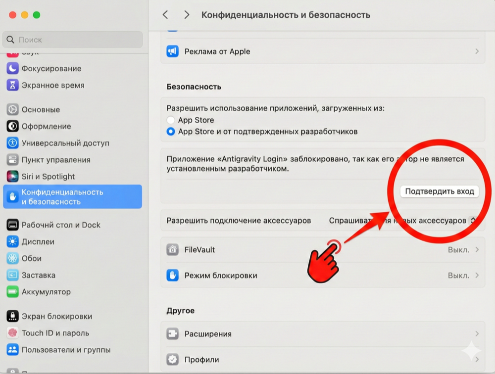
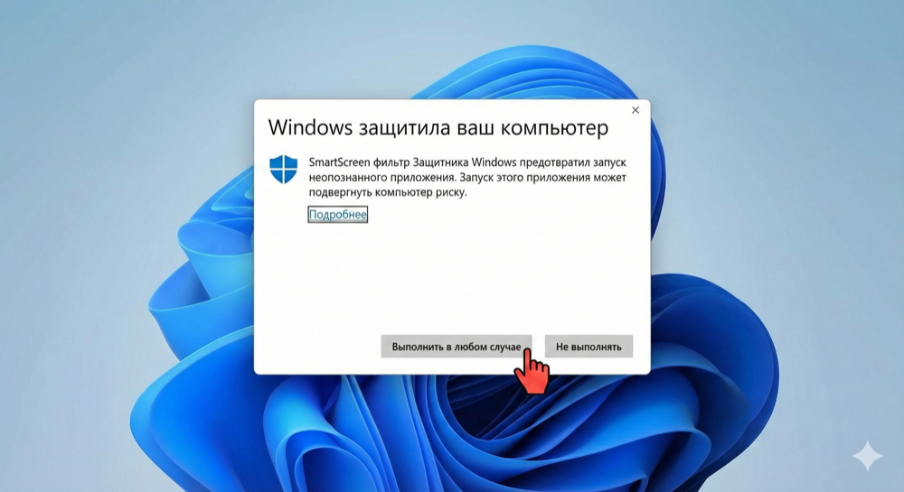

# Antigravity Login 🚀

<div align="center">
  <h3>Профессиональная Система Управления AI Аккаунтами</h3>
  <p>Управляйте множеством аккаунтов Gemini Free,Pro,Ultra,Business. OpenAI-совместимый прокси. </p>
  
  <p>
    
    
    
    
  </p>
</div>

---

## ✨ Основные Возможности

- 🔐 **Управление Аккаунтами** - Безопасное хранение и переключение между множеством AI аккаунтов
- 🌍 **Работа в любой стране** - Запуск Antigravity из стран где Gemini не работает (обход географических ограничений)
- 🌐 **OpenAI-совместимый Прокси** - Используйте Gemini и Claude через стандартный OpenAI API
- 📊 **Мониторинг Квот** - Отслеживание использования и автоматическое обновление квот
- 🔄 **Автоматическое Переключение** - Интеллектуальная ротация аккаунтов при достижении лимитов
- 🛡️ **Защита Квот** - Автоматическая защита аккаунтов от превышения лимитов
- 🌐 **Мультиязычность** - Поддержка русского и английского языков
- 🎨 **Современный UI** - Красивый интерфейс с темной и светлой темами


---

## 💾 Скачать

### 📦 Последняя версия

<table>
  <tr>
    <th>Платформа</th>
    <th>Архитектура</th>
    <th>Скачать</th>
  </tr>
  <tr>
    <td>🍎 macOS</td>
    <td>Universal (Intel + Apple Silicon)</td>
    <td>
      <a href="https://github.com/AntigravityLogin/Releases/releases/latest">
        
      </a>
    </td>
  </tr>
  <tr>
    <td>🪟 Windows</td>
    <td>x64</td>
    <td>
      <a href="https://github.com/AntigravityLogin/Releases/releases/latest">
        
      </a>
    </td>
  </tr>
</table>

### 📋 Все релизы

Посмотреть все доступные версии: **[Releases](https://github.com/AntigravityLogin/Releases/releases)**

---

## 📖 Установка

### macOS

1. **Скачайте** файл `.dmg` из последнего релиза
2. **Откройте** файл и перетащите приложение в папку **Applications**
3. **При первом запуске:**
   - Откройте **Системные настройки** → **Конфиденциальность и безопасность**
   - Нажмите **"Разрешить"** рядом с Antigravity Login
   
     

   - Или: Ctrl+Click на приложении → **Открыть**

### Windows

1. **Скачайте** установщик `.exe` или `.msi` из последнего релиза
2. **Запустите** установщик и следуйте инструкциям
3. **При предупреждении SmartScreen:**
   - Нажмите **"Подробнее"**
   - Выберите **"Выполнить в любом случае"**

   

---

## 🚀 Быстрый Старт

### 1. Первый запуск

После установки запустите приложение. Antigravity Login появится в системном трее (область уведомлений).

### 2. Добавление аккаунта

1. Откройте главное окно приложения
2. Нажмите кнопку **"Добавить аккаунт"**
3. Войдите через OAuth
4. Аккаунт будет автоматически добавлен и активирован

### 3. Настройка прокси

1. Перейдите в раздел **"API Proxy"**
2. Включите прокси-сервер
3. Настройте порт (по умолчанию: 8080)
4. Скопируйте API ключ

### 4. Использование API

Подключайтесь к локальному прокси как к OpenAI API:

```bash
curl http://localhost:8080/v1/chat/completions \
  -H "Content-Type: application/json" \
  -H "Authorization: Bearer YOUR_API_KEY" \
  -d '{
    "model": "gemini-pro",
    "messages": [{"role": "user", "content": "Hello!"}]
  }'
```

---

## 🔒 Приватность и Безопасность

- ✅ **Локальное хранение** - Все данные хранятся только на вашем компьютере
- ✅ **Шифрование** - Токены шифруются и никогда не передаются третьим лицам
- ✅ **Полный контроль** - Вы управляете своими аккаунтами и данными

---

## 🌍 Поддерживаемые Языки

- 🇷🇺 **Русский** (по умолчанию)
- 🇬🇧 **English**

Язык можно изменить в настройках приложения или через меню в навигационной панели.

---

## 🛠️ Системные Требования

### macOS
- macOS 10.15 (Catalina) или новее
- Intel или Apple Silicon (M1/M2/M3)
- 100 MB свободного места

### Windows
- Windows 10 (64-bit) или новее
- x64 процессор
- 100 MB свободного места

---

## 📝 Лицензия

Этот проект распространяется под лицензией [CC BY-NC-SA 4.0](https://creativecommons.org/licenses/by-nc-sa/4.0/).

**Что это значит:**
- ✅ Можно использовать в личных целях
- ✅ Можно модифицировать и адаптировать
- ✅ Можно делиться с другими

---

## 📞 Поддержка и Обратная Связь

### 🐛 Нашли ошибку?

Создайте issue: [Report a Bug](https://github.com/AntigravityLogin/Releases/issues/new?template=bug_report.md)

### 💡 Есть предложение?

Создайте issue: [Feature Request](https://github.com/AntigravityLogin/Releases/issues/new?template=feature_request.md)

### 💬 Нужна помощь?

- 📧 Email: создайте [issue](https://github.com/AntigravityLogin/Releases/issues)
- 💬 Telegram: @X1XFOX1X

---

## 📚 Документация

- 📖 [История изменений](https://github.com/AntigravityLogin/Releases/blob/main/CHANGELOG.md)
- 🔧 [Руководство пользователя](https://github.com/AntigravityLogin/Releases/wiki) (скоро)
- ❓ [FAQ](https://github.com/AntigravityLogin/Releases/wiki/FAQ) (скоро)

---

## 🙏 Благодарности

Спасибо всем, кто использует и поддерживает этот проект!

Особая благодарность:
- Сообществу AI энтузиастов
- Всем, кто сообщает об ошибках и предлагает улучшения
- Разработчикам Tauri, React и других используемых технологий

---

## ⭐ Поддержите Проект

Если вам нравится Antigravity Login:
- ⭐ Поставьте звезду этому репозиторию
- 📢 Расскажите друзьям
- 🐛 Сообщайте об ошибках
- 💡 Предлагайте новые функции

---

---

<div align="center">
  <sub>Сделано с ❤️ для сообщества AI энтузиастов</sub>
  <br>
  <sub>© 2026 Antigravity Login. Все права защищены.</sub>
</div>

---

## 📝 Последние изменения

### Изменения интерфейса (2026-01-27)

- 🔧 **Убрана кнопка "Разогреть все одним кликом"**
  - Кнопка разогрева теперь доступна только при выборе аккаунтов (для выборочного разогрева)
  - Это предотвращает случайный запуск массового разогрева
- 🔧 **Убрана кнопка "Редактировать теги" в пакетных действиях**
  - Кнопка удалена из панели действий при выборе нескольких аккаунтов для упрощения интерфейса

### Версия 1.0.5 (2026-01-26)

- ✅ **Улучшение управления тегами** - Добавлена система автоподстановки тегов
  - При добавлении тега теперь предлагаются уже существующие теги из других аккаунтов
  - Удобный выбор из списка "Доступные теги"
  - Предотвращение дублирования и опечаток
  - Быстрое добавление кликом

### Развернутое окно при запуске (2026-01-25)

- 🖥️ **Запуск в развернутом виде** - Приложение теперь автоматически открывается в максимизированном окне
  - ✅ Максимальное использование рабочего пространства
  - ✅ Улучшенный пользовательский опыт
  - ✅ Доступ ко всем системным элементам управления окном
  - 💡 Можно свернуть или изменить размер окна стандартными средствами ОС

### Исправление локализации (2026-01-25)

- 🔧 **Исправлен перевод кнопки импорта** - Во вкладке "Аккаунты" на русском языке
  - ❌ Было: отображался ключ локализации `accounts.import_json`
  - ✅ Стало: корректный перевод "Импорт"
  - 📝 Добавлены все связанные переводы для функции импорта JSON


---


### Версия 1.0.4 (2026-01-26)
- ✅ **Исправление отображения версии** - Приведены в соответствие все индикаторы версии
- ✅ **Документация релиза** - Добавлено руководство по процессу релиза для разработчиков

### Версия 1.0.1 (2026-01-24)

#### Обновления приложения
- ✅ **Новая иконка приложения** - Современный дизайн с металлическим эффектом и градиентной подсветкой
- ✅ Обновлена контактная информация: Telegram (@X1XFOX1X) вместо WeChat
- ✅ Изменён автор на X1XFOX1X
- ✅ Обновлена ссылка на GitHub в настройках приложения (раздел "О программе")
- ✅ Расширена документация функции Warmup (Разогрев)

### Версия 1.0.0 (2026-01-24)

#### Первый стабильный релиз
- ✅ Добавлено подробное описание функции **Warmup (Разогрев)**
  - Объяснение назначения и принципа работы
  - Описание автоматического и ручного режимов
  - Технические детали и настройки
  - Раздел FAQ по использованию Warmup
- ✅ Добавлена функция в список основных возможностей

